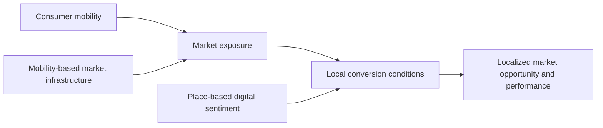

# Consumer Mobility Dissertation

**Research materials for a three-paper PhD dissertation on consumer mobility, market exposure, local conversion conditions, and localized market performance.**

This repository contains the code, documentation, data dictionaries, and non-restricted supporting materials associated with Rafael Pereira Albuquerque's PhD dissertation in Marketing at the Federal University of Rio Grande do Sul (UFRGS), Brazil.

## Dissertation overview

Firms can increasingly observe where consumers move, but movement alone does not show whether consumers encounter a market opportunity or whether that exposure becomes a local outcome. The dissertation addresses this problem by separating consumer mobility, market exposure, localized market opportunity, and market performance, while examining the place-based conditions that connect these stages.

> **General research question:** How can digital, spatial, and mobility-related evidence help explain and diagnose the conditions under which consumer exposure may become localized market opportunity and market performance across places?

The dissertation aims to explain how these forms of evidence help firms and researchers understand this process while preserving what each data source actually observes. Its central argument is that mobility creates the possibility of market exposure, local conversion conditions are associated with whether that exposure becomes opportunity and performance, and recurrent access can be examined before direct outcomes are available.



The three papers perform different theoretical and empirical roles within this argument:

| Chapter | Study | Role in the dissertation | Public materials |
|---|---|---|---|
| **Chapter 2 / Paper 1** | *Consumer Mobility and Localized Market Performance: A Systematic Review with an Integrative Synthesis of Market Exposure and Conversion* | Develops the exposure-conversion framework through a systematic review and integrative synthesis of 86 journal articles. | Search strategies, eligibility criteria, screening documentation, coding framework, PRISMA counts, and included-study matrix. |
| **Chapter 3 / Paper 2** | *From Consumer Mobility to Localized Sales Performance: Place-Based Digital Sentiment and the Local Market Conversion Gap* | Examines why comparable consumer mobility is associated with different localized sales performance across 726 urban census tracts. | GEWI construction code, mobility preprocessing, spatial-analysis code, diagnostics, and data dictionaries. |
| **Chapter 4 / Paper 3** | *Consumer Mobility and the Spatial Organization of Local Market Access* | Examines mobility-based market infrastructure as a pre-outcome access dimension across 387,779 Brazilian census tracts. | Analytical notebook, parameters, environment specification, data documentation, and non-restricted supporting outputs. |

## Repository structure

```text
consumer-mobility-dissertation/
├── chapter_2_paper_1/
│   ├── search_strategy/
│   ├── screening_documentation/
│   ├── coding_framework/
│   ├── included_studies/
│   └── scripts/
├── chapter_3_paper_2/
│   ├── notebooks/
│   ├── data_dictionary/
│   ├── data/
│   └── environment/
├── chapter_4_paper_3/
│   ├── notebooks/
│   ├── data_dictionary/
│   ├── data/
│   ├── environment/
│   └── outputs/
├── REPOSITORY_MANIFEST.md
└── README.md
```

Each chapter directory includes a README that explains the files, their analytical role, the expected execution order, and their relationship with the dissertation's tables and figures.

## Data access and reproducibility

This repository distinguishes **public analytical materials** from **restricted empirical data**.

### Publicly available here

- analytical and preprocessing code;
- parameter choices and workflow documentation;
- data dictionaries and expected input structures;
- systematic-review search and screening documentation;
- non-restricted tables, figures, and supporting outputs; and
- chapter-specific environment specifications.

### Not redistributed

- proprietary aggregated mobile-location data;
- restricted geolocated digital-discourse records;
- confidential transaction data;
- provider-level or derived files whose redistribution is limited; and
- commercial database exports and copyrighted article files used during the systematic review.

The absence of these inputs is intentional. The notebooks make the analytical procedures inspectable, while full data-dependent execution requires authorized access to the corresponding restricted files. No restricted data, personal identifiers, device histories, or individual trajectories are included in the repository.

## Using the materials

Clone the repository and open the README for the chapter you want to examine:

```bash
git clone https://github.com/RPAlbuquerque/consumer-mobility-dissertation.git
cd consumer-mobility-dissertation
```

- Begin with [`chapter_2_paper_1/`](chapter_2_paper_1/) for the review protocol and evidence corpus.
- Use [`chapter_3_paper_2/`](chapter_3_paper_2/) for the GEWI, spatial-econometric, and diagnostic workflow.
- Use [`chapter_4_paper_3/`](chapter_4_paper_3/) for the mobility-based market infrastructure workflow.

Installation and input instructions are chapter-specific because the empirical studies use different data structures and dependencies.

## Recognition

The project that originated Chapter 4, *From Mobility Intensity to Market Infrastructure: A Spatial AI Framework for Recovering Hidden Spatial Regimes and Multiscale Variation*, received **third place in the [I-GUIDE Spatial AI Challenge 2025-26](https://i-guide.io/spatial-ai-challenge-2025-26/challenge-winners/)**. The project team comprised Rafael Albuquerque, Jéssica Miranda, Vinicius Andrade Brei, and Siqin (Sisi) Wang.

## Citation

Please cite the dissertation and the relevant paper or chapter when using these materials. Complete bibliographic information will be added after the dissertation is deposited in the UFRGS institutional repository. Until that record is available, the repository may be cited as:

> Albuquerque, R. P. (2026). *Consumer mobility dissertation: Research materials* [Code and documentation]. GitHub. https://github.com/RPAlbuquerque/consumer-mobility-dissertation

## Versioning

The materials corresponding to the dissertation submitted for examination will be preserved as the Git tag and GitHub release **`v1.0-thesis`**. Any later corrections or extensions will be documented through subsequent releases.

## Author

**Rafael Pereira Albuquerque**  
PhD candidate in Business Administration, emphasis in Marketing  
Federal University of Rio Grande do Sul (UFRGS), Brazil  
[GitHub profile](https://github.com/RPAlbuquerque)

## Rights and responsibility

All analytical and interpretive decisions remain the responsibility of the authors. Third-party data remain subject to their original access conditions, and no third-party data license is granted through this repository.
